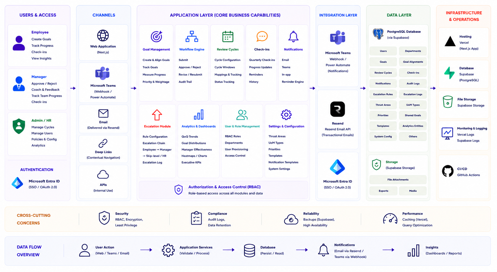

# atomquest-portal

<p align="center">
  
</p>

## Overview

AtomQuest Portal is a role-based goal operations platform for quarterly planning, execution tracking, governance, and review-cycle management. Employees create and track goals, managers review team execution and approvals, and administrators oversee governance workflows, reporting, shared goals, audit visibility, and operational readiness.

The platform is built with Next.js App Router, Auth.js, Prisma, PostgreSQL, and feature-scoped workflow modules supporting notifications, exports, analytics, and escalation evaluation.

---

## Quick Start

```bash
npm install
npx prisma migrate dev
npx prisma db seed
npm run dev
```

Open:

```text
http://localhost:3000
```

---

## Demo Credentials

After running:

```bash
npx prisma db seed
```

Use the following seeded demo accounts:

| Role | Email |
| --- | --- |
| Admin | `atomquest.admin.demo@gmail.com` |
| Manager | `atomquest.manager.demo@gmail.com` |
| Employee | `atomquest.employee.demo@gmail.com` |

Password:

```text
Password@123
```

---

## Key Features

### Role-Aware Authentication & Access Control

- Auth.js / NextAuth v5 authentication.
- Credentials login and Microsoft Entra ID provider support.
- Role-based dashboard routing using `src/proxy.ts`.
- Dashboard isolation for:
  - `ADMIN`
  - `MANAGER`
  - `EMPLOYEE`
- Existing Microsoft accounts must match active local database users.

### Employee Workflows

- Create and edit draft goals.
- Submit goals for manager approval.
- Track:
  - approval state
  - progress
  - overdue status
  - shared-goal participation
  - activity history
  - manager feedback
- Submit quarterly updates for approved goals.

### Manager Workflows

- Review direct-report goals.
- Approve or reject submissions with comments.
- Monitor:
  - team progress
  - overdue exposure
  - approval readiness
  - quarterly update recency
- Propagate approved goals to direct reports as shared goals.
- Export direct-report reports and update summaries.

### Administrative Governance

- Manage quarterly review cycles.
- Lock and unlock approved goals.
- Monitor workforce visibility and role coverage.
- Review audit logs and shared-goal activity.
- Export:
  - goals
  - quarterly updates
  - audit logs
  - governance reports

### Notifications & Reminder Support

- Notification orchestrator with:
  - Resend email delivery
  - Microsoft Teams webhook delivery
- Supported notification events:
  - goal submitted
  - goal approved
  - goal rejected
  - check-in reminder
- Scheduled reminder endpoint:

```text
GET /api/cron/reminders/checkin
```

### Escalation Evaluation Framework

- Feature-scoped escalation evaluator modules.
- Rule-based operational governance checks.
- Tracks unresolved workflow conditions and escalation states.
- Current implementation provides deterministic evaluation modules without automated scheduler orchestration.

---

## Tech Stack

### Frontend

- Next.js 16.2.6 App Router
- React 19
- TypeScript 5
- Tailwind CSS 4
- shadcn/ui + Radix UI
- lucide-react
- Sonner
- Recharts
- @tanstack/react-table
- React Hook Form
- Zod

### Backend

- Next.js Server Components
- Server Actions
- Route Handlers
- Proxy middleware
- Auth.js / NextAuth v5
- JWT sessions
- ExcelJS

### Database

- PostgreSQL
- Prisma ORM
- `@prisma/adapter-pg`
- `pg`

### Authentication

- Credentials provider
- bcryptjs password verification
- Microsoft Entra ID provider

### Integrations

- Resend email provider
- Microsoft Teams incoming webhooks

### Tooling

- npm
- ESLint 9
- Prisma CLI
- tsx

---

## Architecture


### System Overview

- Next.js App Router powers role-specific dashboard experiences for employees, managers, and administrators.
- Auth.js and `src/proxy.ts` enforce authentication, authorization, and dashboard routing.
- Prisma and PostgreSQL manage workflow entities including goals, review cycles, approvals, updates, audit logs, and escalation records.
- Notification orchestration supports Resend email delivery and Microsoft Teams webhook integrations.
- Feature-scoped escalation evaluators provide rule-based operational governance checks for overdue workflow conditions.

### Core Runtime Layers

| Layer | Responsibility |
| --- | --- |
| Presentation Layer | App Router pages, dashboards, UI components |
| Authentication Layer | Auth.js sessions, route protection, role routing |
| Workflow Layer | Goal lifecycle, approvals, updates, governance |
| Escalation Layer | Rule-based evaluation and escalation logic |
| Notification Layer | Email and Teams notification dispatch |
| Persistence Layer | Prisma ORM + PostgreSQL |

---

## Repository Structure

```text
.
|-- docs/
|   `-- architecture/                # Architecture assets and diagrams
|
|-- prisma/
|   |-- migrations/                  # Prisma migration history
|   |-- seed-data/                   # Seed modules
|   |-- schema.prisma                # PostgreSQL data model
|   `-- seed.ts                      # Demo seed entry point
|
|-- public/                          # Static assets
|
|-- src/
|   |-- actions/                     # Server actions by workflow area
|   |-- app/                         # Next.js App Router routes
|   |-- components/                  # Shared UI and dashboard components
|   |-- features/                    # Feature-scoped modules
|   |-- hooks/                       # Shared hooks
|   |-- lib/                         # Core domain logic and utilities
|   |-- auth.ts                      # Auth.js configuration
|   `-- proxy.ts                     # Role-aware dashboard proxy
|
|-- AGENTS.md                        # Repository instructions
|-- components.json                  # shadcn configuration
|-- next.config.ts                   # Next.js configuration
|-- package.json                     # Dependencies and scripts
|-- prisma.config.ts                 # Prisma CLI configuration
`-- tsconfig.json                    # TypeScript configuration
```

---

## Prerequisites

- Node.js 20.9 or newer
- npm
- PostgreSQL database
- Microsoft Entra ID credentials (optional for Microsoft login)
- Optional notification provider credentials:
  - Resend API key
  - Microsoft Teams webhook URL

---

## Local Development Setup

### 1. Install Dependencies

```bash
npm install
```

`postinstall` automatically runs:

```bash
prisma generate
```

---

### 2. Configure Environment Variables

Create a root `.env` file.

See the Environment Variables section below.

---

### 3. Apply Prisma Migrations

```bash
npx prisma migrate dev
```

---

### 4. Seed Demo Data (Optional)

```bash
npx prisma db seed
```

The seed includes:
- demo users
- review cycles
- goals
- approvals
- quarterly updates
- shared-goal groups
- escalation governance records
- audit logs

---

### 5. Start Development Server

```bash
npm run dev
```

Application URL:

```text
http://localhost:3000
```

---

## Environment Variables

| Variable | Required | Purpose |
| --- | --- | --- |
| `DATABASE_URL` | Yes | Prisma runtime PostgreSQL connection |
| `DIRECT_URL` | Yes for Prisma CLI | Direct PostgreSQL connection |
| `AUTH_URL` | Yes | Auth.js application URL |
| `AUTH_SECRET` | Yes | Auth.js secret |
| `AUTH_TRUST_HOST` | Environment-specific | Host trust configuration |
| `AUTH_MICROSOFT_ENTRA_ID_ID` | Optional | Microsoft Entra ID client ID |
| `AUTH_MICROSOFT_ENTRA_ID_SECRET` | Optional | Microsoft Entra ID client secret |
| `AUTH_MICROSOFT_ENTRA_ID_ISSUER` | Optional | Microsoft Entra ID issuer |
| `APP_BASE_URL` | Optional | Notification deep-link base URL |
| `RESEND_API_KEY` | Optional | Enables Resend email delivery |
| `EMAIL_FROM` | Optional | Sender email address |
| `NOTIFICATION_EMAIL_OVERRIDE` | Optional | Redirects outbound email |
| `TEAMS_WEBHOOK_URL` | Optional | Enables Teams notifications |
| `CRON_SECRET` | Recommended | Secures cron reminder endpoint |

No `NEXT_PUBLIC_` variables were detected in the implementation.

---

## Available Scripts / Commands

| Command | Description |
| --- | --- |
| `npm run dev` | Start development server |
| `npm run build` | Production build |
| `npm run start` | Start production server |
| `npm run lint` | Run ESLint |
| `npx prisma validate` | Validate Prisma schema |
| `npx prisma migrate dev` | Apply development migrations |
| `npx prisma db seed` | Seed demo data |

---

## Testing / Linting / Formatting

### Validation Commands

```bash
npm run lint
npm run build
npx prisma validate
```

### Current Status

- ESLint completes successfully with warnings only.
- `next build` completes successfully using Next.js 16.2.6.
- Prisma schema validation passes.

### To Be Confirmed

- Automated test framework
- Dedicated formatting workflow
- CI/CD pipeline configuration

---

## Deployment / Production Notes

- No hosting-provider deployment configuration is currently committed.
- Production runtime requires:
  - PostgreSQL database
  - Prisma client generation
  - configured environment variables
- Reminder route:

```text
/api/cron/reminders/checkin
```

exists, but no scheduler/orchestrator configuration is currently committed.

### Recommended Production Hardening

- Configure `CRON_SECRET`
- Enforce HTTPS-only deployment
- Use managed PostgreSQL backups
- Rotate authentication and provider secrets
- Add centralized scheduler orchestration for escalation evaluation and reminders

---

## Usage Overview

### Public Routes

| Route | Purpose |
| --- | --- |
| `/` | Landing page |
| `/sign-in` | Credentials and Microsoft login |

### Dashboard Routes

| Role | Route |
| --- | --- |
| Admin | `/dashboard/admin` |
| Manager | `/dashboard/manager/team-goals` |
| Employee | `/dashboard/employee` |

### Typical Workflow

1. Administrator activates a review cycle.
2. Employees create and submit goals.
3. Managers review and approve or reject goals.
4. Employees submit quarterly updates.
5. Managers and administrators monitor execution, analytics, exports, shared goals, and audit activity.

---

## Contribution Notes

- Follow repository guidance in `AGENTS.md`.
- Keep role authorization aligned across:
  - `src/proxy.ts`
  - server actions
  - dashboard routes
  - export handlers
- Update Prisma migrations and seed data together when changing the schema.
- Preserve auditability for workflow mutations.
- Run validation commands before submitting changes.

---

## License

License not specified in repository.

---

## Troubleshooting / Known Limitations

### Common Issues

- Missing `DATABASE_URL` causes Prisma runtime initialization failures.
- Missing `DIRECT_URL` prevents Prisma CLI operations.
- Microsoft sign-in requires:
  - valid Entra ID credentials
  - matching active local user
- Notification providers skip delivery when credentials are missing.

### Current Implementation Limitations

- No automated test suite is configured.
- No formatting workflow is configured.
- Escalation evaluators exist without automated scheduler orchestration.
- Reminder route authorization is optional when `CRON_SECRET` is not configured.
- Deployment infrastructure configuration is not yet committed.